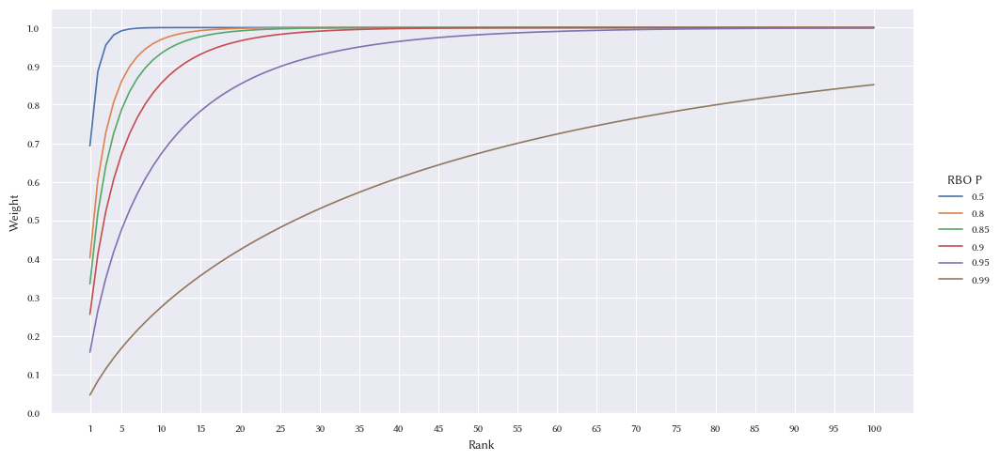
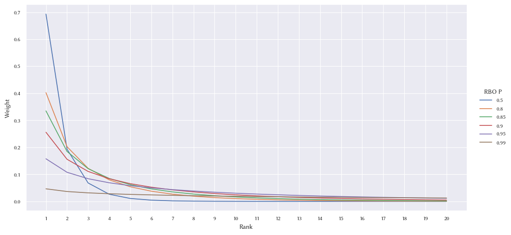

# RBO Weight

The repository describes the _RBO Weights_ defined in Eq. 19 and Eq. 21 in Sec
4.3, not the weights used in Eq. 7.

```
William Webber, Alistair Moffat, and Justin Zobel. "A similarity measure for
indefinite rankings." ACM Transactions on Information Systems (TOIS) 28.4
(2010): 1-38.
```

## Cumulative Weight



## Discrete Weight



## Cumulative Weight Table

|   Rank |      0.5 |      0.8 |     0.85 |      0.9 |     0.95 |     0.99 |
|-------:|---------:|---------:|---------:|---------:|---------:|---------:|
|      1 | 0.693147 | 0.402359 | 0.334786 | 0.255843 | 0.157670 | 0.046517 |
|      2 | 0.886294 | 0.604719 | 0.519572 | 0.411686 | 0.265340 | 0.083034 |
|      3 | 0.954442 | 0.727078 | 0.640608 | 0.522528 | 0.349260 | 0.114601 |
|      4 | 0.980922 | 0.806771 | 0.725519 | 0.606371 | 0.418139 | 0.142900 |
|      5 | 0.991778 | 0.860864 | 0.787400 | 0.671989 | 0.476300 | 0.168775 |
|      6 | 0.996383 | 0.898573 | 0.833621 | 0.724485 | 0.526316 | 0.192728 |
|      7 | 0.998384 | 0.925359 | 0.868749 | 0.767139 | 0.569884 | 0.215095 |
|      8 | 0.999270 | 0.944655 | 0.895796 | 0.802201 | 0.608202 | 0.236118 |
|      9 | 0.999667 | 0.958709 | 0.916831 | 0.831285 | 0.642154 | 0.255976 |
|     10 | 0.999847 | 0.969034 | 0.933326 | 0.855585 | 0.672422 | 0.274809 |
|     11 | 0.999929 | 0.976675 | 0.946346 | 0.876012 | 0.699537 | 0.292728 |
|     12 | 0.999967 | 0.982363 | 0.956681 | 0.893268 | 0.723932 | 0.309825 |
|     13 | 0.999985 | 0.986620 | 0.964925 | 0.907910 | 0.745956 | 0.326176 |
|     14 | 0.999993 | 0.989820 | 0.971527 | 0.920379 | 0.765902 | 0.341845 |
|     15 | 0.999997 | 0.992234 | 0.976834 | 0.931032 | 0.784015 | 0.356887 |
|     16 | 0.999998 | 0.994062 | 0.981113 | 0.940160 | 0.800502 | 0.371350 |
|     17 | 0.999999 | 0.995450 | 0.984573 | 0.948002 | 0.815541 | 0.385276 |
|     18 | 1.000000 | 0.996507 | 0.987378 | 0.954753 | 0.829286 | 0.398700 |
|     19 | 1.000000 | 0.997314 | 0.989658 | 0.960578 | 0.841869 | 0.411657 |
|     20 | 1.000000 | 0.997931 | 0.991513 | 0.965613 | 0.853407 | 0.424174 |
|     21 | 1.000000 | 0.998404 | 0.993027 | 0.969973 | 0.864002 | 0.436278 |
|     22 | 1.000000 | 0.998767 | 0.994264 | 0.973753 | 0.873743 | 0.447992 |
|     23 | 1.000000 | 0.999047 | 0.995276 | 0.977036 | 0.882710 | 0.459339 |
|     24 | 1.000000 | 0.999262 | 0.996105 | 0.979891 | 0.890974 | 0.470337 |
|     25 | 1.000000 | 0.999428 | 0.996786 | 0.982377 | 0.898597 | 0.481004 |
|     26 | 1.000000 | 0.999556 | 0.997345 | 0.984544 | 0.905637 | 0.491357 |
|     27 | 1.000000 | 0.999655 | 0.997806 | 0.986434 | 0.912143 | 0.501411 |
|     28 | 1.000000 | 0.999732 | 0.998185 | 0.988086 | 0.918161 | 0.511179 |
|     29 | 1.000000 | 0.999791 | 0.998497 | 0.989529 | 0.923732 | 0.520676 |
|     30 | 1.000000 | 0.999838 | 0.998755 | 0.990792 | 0.928893 | 0.529912 |
|     31 | 1.000000 | 0.999874 | 0.998968 | 0.991898 | 0.933677 | 0.538899 |
|     32 | 1.000000 | 0.999901 | 0.999143 | 0.992868 | 0.938115 | 0.547647 |
|     33 | 1.000000 | 0.999923 | 0.999289 | 0.993718 | 0.942235 | 0.556167 |
|     34 | 1.000000 | 0.999940 | 0.999409 | 0.994464 | 0.946061 | 0.564467 |
|     35 | 1.000000 | 0.999953 | 0.999509 | 0.995119 | 0.949616 | 0.572556 |
|     36 | 1.000000 | 0.999963 | 0.999592 | 0.995695 | 0.952922 | 0.580442 |
|     37 | 1.000000 | 0.999971 | 0.999661 | 0.996201 | 0.955997 | 0.588132 |
|     38 | 1.000000 | 0.999978 | 0.999717 | 0.996646 | 0.958859 | 0.595634 |
|     39 | 1.000000 | 0.999982 | 0.999765 | 0.997038 | 0.961524 | 0.602955 |
|     40 | 1.000000 | 0.999986 | 0.999804 | 0.997383 | 0.964006 | 0.610101 |
|     41 | 1.000000 | 0.999989 | 0.999837 | 0.997688 | 0.966319 | 0.617078 |
|     42 | 1.000000 | 0.999992 | 0.999864 | 0.997956 | 0.968475 | 0.623891 |
|     43 | 1.000000 | 0.999993 | 0.999886 | 0.998192 | 0.970486 | 0.630547 |
|     44 | 1.000000 | 0.999995 | 0.999905 | 0.998401 | 0.972362 | 0.637051 |
|     45 | 1.000000 | 0.999996 | 0.999921 | 0.998585 | 0.974113 | 0.643407 |
|     46 | 1.000000 | 0.999997 | 0.999934 | 0.998747 | 0.975747 | 0.649620 |
|     47 | 1.000000 | 0.999997 | 0.999945 | 0.998891 | 0.977273 | 0.655695 |
|     48 | 1.000000 | 0.999998 | 0.999954 | 0.999017 | 0.978699 | 0.661636 |
|     49 | 1.000000 | 0.999998 | 0.999962 | 0.999130 | 0.980032 | 0.667446 |
|     50 | 1.000000 | 0.999999 | 0.999968 | 0.999229 | 0.981277 | 0.673131 |
|     51 | 1.000000 | 0.999999 | 0.999973 | 0.999316 | 0.982442 | 0.678694 |
|     52 | 1.000000 | 0.999999 | 0.999977 | 0.999394 | 0.983531 | 0.684138 |
|     53 | 1.000000 | 0.999999 | 0.999981 | 0.999462 | 0.984549 | 0.689467 |
|     54 | 1.000000 | 1.000000 | 0.999984 | 0.999523 | 0.985503 | 0.694684 |
|     55 | 1.000000 | 1.000000 | 0.999987 | 0.999577 | 0.986395 | 0.699793 |
|     56 | 1.000000 | 1.000000 | 0.999989 | 0.999625 | 0.987230 | 0.704795 |
|     57 | 1.000000 | 1.000000 | 0.999991 | 0.999667 | 0.988012 | 0.709695 |
|     58 | 1.000000 | 1.000000 | 0.999992 | 0.999704 | 0.988744 | 0.714495 |
|     59 | 1.000000 | 1.000000 | 0.999994 | 0.999737 | 0.989430 | 0.719198 |
|     60 | 1.000000 | 1.000000 | 0.999995 | 0.999767 | 0.990073 | 0.723806 |
|     61 | 1.000000 | 1.000000 | 0.999995 | 0.999793 | 0.990676 | 0.728322 |
|     62 | 1.000000 | 1.000000 | 0.999996 | 0.999816 | 0.991240 | 0.732749 |
|     63 | 1.000000 | 1.000000 | 0.999997 | 0.999837 | 0.991770 | 0.737088 |
|     64 | 1.000000 | 1.000000 | 0.999997 | 0.999855 | 0.992266 | 0.741341 |
|     65 | 1.000000 | 1.000000 | 0.999998 | 0.999871 | 0.992731 | 0.745512 |
|     66 | 1.000000 | 1.000000 | 0.999998 | 0.999885 | 0.993168 | 0.749602 |
|     67 | 1.000000 | 1.000000 | 0.999998 | 0.999898 | 0.993578 | 0.753614 |
|     68 | 1.000000 | 1.000000 | 0.999999 | 0.999909 | 0.993962 | 0.757548 |
|     69 | 1.000000 | 1.000000 | 0.999999 | 0.999919 | 0.994322 | 0.761407 |
|     70 | 1.000000 | 1.000000 | 0.999999 | 0.999928 | 0.994661 | 0.765193 |
|     71 | 1.000000 | 1.000000 | 0.999999 | 0.999936 | 0.994979 | 0.768908 |
|     72 | 1.000000 | 1.000000 | 0.999999 | 0.999943 | 0.995277 | 0.772553 |
|     73 | 1.000000 | 1.000000 | 0.999999 | 0.999949 | 0.995557 | 0.776130 |
|     74 | 1.000000 | 1.000000 | 1.000000 | 0.999955 | 0.995820 | 0.779641 |
|     75 | 1.000000 | 1.000000 | 1.000000 | 0.999960 | 0.996068 | 0.783086 |
|     76 | 1.000000 | 1.000000 | 1.000000 | 0.999964 | 0.996300 | 0.786469 |
|     77 | 1.000000 | 1.000000 | 1.000000 | 0.999968 | 0.996518 | 0.789789 |
|     78 | 1.000000 | 1.000000 | 1.000000 | 0.999972 | 0.996723 | 0.793049 |
|     79 | 1.000000 | 1.000000 | 1.000000 | 0.999975 | 0.996915 | 0.796250 |
|     80 | 1.000000 | 1.000000 | 1.000000 | 0.999978 | 0.997096 | 0.799393 |
|     81 | 1.000000 | 1.000000 | 1.000000 | 0.999980 | 0.997267 | 0.802479 |
|     82 | 1.000000 | 1.000000 | 1.000000 | 0.999982 | 0.997426 | 0.805510 |
|     83 | 1.000000 | 1.000000 | 1.000000 | 0.999984 | 0.997577 | 0.808488 |
|     84 | 1.000000 | 1.000000 | 1.000000 | 0.999986 | 0.997718 | 0.811412 |
|     85 | 1.000000 | 1.000000 | 1.000000 | 0.999987 | 0.997851 | 0.814285 |
|     86 | 1.000000 | 1.000000 | 1.000000 | 0.999989 | 0.997976 | 0.817107 |
|     87 | 1.000000 | 1.000000 | 1.000000 | 0.999990 | 0.998094 | 0.819879 |
|     88 | 1.000000 | 1.000000 | 1.000000 | 0.999991 | 0.998205 | 0.822603 |
|     89 | 1.000000 | 1.000000 | 1.000000 | 0.999992 | 0.998309 | 0.825280 |
|     90 | 1.000000 | 1.000000 | 1.000000 | 0.999993 | 0.998407 | 0.827910 |
|     91 | 1.000000 | 1.000000 | 1.000000 | 0.999994 | 0.998499 | 0.830495 |
|     92 | 1.000000 | 1.000000 | 1.000000 | 0.999994 | 0.998586 | 0.833036 |
|     93 | 1.000000 | 1.000000 | 1.000000 | 0.999995 | 0.998667 | 0.835533 |
|     94 | 1.000000 | 1.000000 | 1.000000 | 0.999996 | 0.998744 | 0.837987 |
|     95 | 1.000000 | 1.000000 | 1.000000 | 0.999996 | 0.998816 | 0.840399 |
|     96 | 1.000000 | 1.000000 | 1.000000 | 0.999996 | 0.998884 | 0.842771 |
|     97 | 1.000000 | 1.000000 | 1.000000 | 0.999997 | 0.998948 | 0.845102 |
|     98 | 1.000000 | 1.000000 | 1.000000 | 0.999997 | 0.999009 | 0.847394 |
|     99 | 1.000000 | 1.000000 | 1.000000 | 0.999997 | 0.999066 | 0.849648 |
|    100 | 1.000000 | 1.000000 | 1.000000 | 0.999998 | 0.999119 | 0.851864 |

## Discrete Weight Table

|   Rank |      0.5 |      0.8 |     0.85 |      0.9 |     0.95 |     0.99 |
|-------:|---------:|---------:|---------:|---------:|---------:|---------:|
|      1 | 0.693147 | 0.402359 | 0.334786 | 0.255843 | 0.157670 | 0.046517 |
|      2 | 0.193147 | 0.202359 | 0.184786 | 0.155843 | 0.107670 | 0.036517 |
|      3 | 0.068147 | 0.122359 | 0.121036 | 0.110843 | 0.083920 | 0.031567 |
|      4 | 0.026481 | 0.079693 | 0.084911 | 0.083843 | 0.068878 | 0.028300 |
|      5 | 0.010856 | 0.054093 | 0.061881 | 0.065618 | 0.058161 | 0.025874 |
|      6 | 0.004606 | 0.037709 | 0.046221 | 0.052496 | 0.050016 | 0.023953 |
|      7 | 0.002001 | 0.026786 | 0.035128 | 0.042654 | 0.043568 | 0.022368 |
|      8 | 0.000885 | 0.019296 | 0.027047 | 0.035062 | 0.038317 | 0.021023 |
|      9 | 0.000397 | 0.014053 | 0.021036 | 0.029084 | 0.033953 | 0.019858 |
|     10 | 0.000180 | 0.010325 | 0.016494 | 0.024301 | 0.030267 | 0.018833 |
|     11 | 0.000082 | 0.007641 | 0.013020 | 0.020426 | 0.027116 | 0.017919 |
|     12 | 0.000038 | 0.005689 | 0.010335 | 0.017257 | 0.024394 | 0.017097 |
|     13 | 0.000018 | 0.004257 | 0.008244 | 0.014641 | 0.022024 | 0.016351 |
|     14 | 0.000008 | 0.003200 | 0.006602 | 0.012469 | 0.019946 | 0.015669 |
|     15 | 0.000004 | 0.002414 | 0.005307 | 0.010653 | 0.018113 | 0.015042 |
|     16 | 0.000002 | 0.001828 | 0.004279 | 0.009128 | 0.016487 | 0.014463 |
|     17 | 0.000001 | 0.001388 | 0.003460 | 0.007841 | 0.015039 | 0.013925 |
|     18 | 0.000000 | 0.001057 | 0.002805 | 0.006751 | 0.013745 | 0.013425 |
|     19 | 0.000000 | 0.000807 | 0.002279 | 0.005825 | 0.012583 | 0.012956 |
|     20 | 0.000000 | 0.000617 | 0.001856 | 0.005035 | 0.011538 | 0.012517 |
|     21 | 0.000000 | 0.000473 | 0.001514 | 0.004359 | 0.010595 | 0.012104 |
|     22 | 0.000000 | 0.000363 | 0.001237 | 0.003781 | 0.009741 | 0.011715 |
|     23 | 0.000000 | 0.000279 | 0.001012 | 0.003283 | 0.008967 | 0.011346 |
|     24 | 0.000000 | 0.000215 | 0.000830 | 0.002855 | 0.008264 | 0.010998 |
|     25 | 0.000000 | 0.000166 | 0.000681 | 0.002486 | 0.007623 | 0.010667 |
|     26 | 0.000000 | 0.000128 | 0.000559 | 0.002167 | 0.007039 | 0.010353 |
|     27 | 0.000000 | 0.000099 | 0.000460 | 0.001891 | 0.006506 | 0.010054 |
|     28 | 0.000000 | 0.000077 | 0.000379 | 0.001651 | 0.006018 | 0.009769 |
|     29 | 0.000000 | 0.000060 | 0.000312 | 0.001444 | 0.005571 | 0.009496 |
|     30 | 0.000000 | 0.000046 | 0.000258 | 0.001263 | 0.005161 | 0.009236 |
|     31 | 0.000000 | 0.000036 | 0.000213 | 0.001106 | 0.004784 | 0.008987 |
|     32 | 0.000000 | 0.000028 | 0.000176 | 0.000969 | 0.004438 | 0.008748 |
|     33 | 0.000000 | 0.000022 | 0.000146 | 0.000850 | 0.004120 | 0.008520 |
|     34 | 0.000000 | 0.000017 | 0.000120 | 0.000746 | 0.003826 | 0.008300 |
|     35 | 0.000000 | 0.000013 | 0.000100 | 0.000655 | 0.003555 | 0.008089 |
|     36 | 0.000000 | 0.000010 | 0.000083 | 0.000576 | 0.003306 | 0.007886 |
|     37 | 0.000000 | 0.000008 | 0.000069 | 0.000506 | 0.003075 | 0.007690 |
|     38 | 0.000000 | 0.000006 | 0.000057 | 0.000445 | 0.002862 | 0.007502 |
|     39 | 0.000000 | 0.000005 | 0.000047 | 0.000392 | 0.002665 | 0.007321 |
|     40 | 0.000000 | 0.000004 | 0.000039 | 0.000345 | 0.002482 | 0.007146 |
|     41 | 0.000000 | 0.000003 | 0.000033 | 0.000304 | 0.002313 | 0.006977 |
|     42 | 0.000000 | 0.000002 | 0.000027 | 0.000268 | 0.002156 | 0.006814 |
|     43 | 0.000000 | 0.000002 | 0.000023 | 0.000236 | 0.002011 | 0.006656 |
|     44 | 0.000000 | 0.000001 | 0.000019 | 0.000209 | 0.001876 | 0.006503 |
|     45 | 0.000000 | 0.000001 | 0.000016 | 0.000184 | 0.001751 | 0.006356 |
|     46 | 0.000000 | 0.000001 | 0.000013 | 0.000163 | 0.001635 | 0.006213 |
|     47 | 0.000000 | 0.000001 | 0.000011 | 0.000144 | 0.001526 | 0.006075 |
|     48 | 0.000000 | 0.000001 | 0.000009 | 0.000127 | 0.001426 | 0.005941 |
|     49 | 0.000000 | 0.000000 | 0.000008 | 0.000112 | 0.001332 | 0.005811 |
|     50 | 0.000000 | 0.000000 | 0.000006 | 0.000099 | 0.001245 | 0.005685 |
|     51 | 0.000000 | 0.000000 | 0.000005 | 0.000088 | 0.001164 | 0.005563 |
|     52 | 0.000000 | 0.000000 | 0.000004 | 0.000078 | 0.001089 | 0.005444 |
|     53 | 0.000000 | 0.000000 | 0.000004 | 0.000069 | 0.001019 | 0.005329 |
|     54 | 0.000000 | 0.000000 | 0.000003 | 0.000061 | 0.000953 | 0.005217 |
|     55 | 0.000000 | 0.000000 | 0.000003 | 0.000054 | 0.000892 | 0.005108 |
|     56 | 0.000000 | 0.000000 | 0.000002 | 0.000048 | 0.000835 | 0.005003 |
|     57 | 0.000000 | 0.000000 | 0.000002 | 0.000042 | 0.000782 | 0.004900 |
|     58 | 0.000000 | 0.000000 | 0.000002 | 0.000037 | 0.000732 | 0.004800 |
|     59 | 0.000000 | 0.000000 | 0.000001 | 0.000033 | 0.000686 | 0.004703 |
|     60 | 0.000000 | 0.000000 | 0.000001 | 0.000029 | 0.000643 | 0.004608 |
|     61 | 0.000000 | 0.000000 | 0.000001 | 0.000026 | 0.000602 | 0.004516 |
|     62 | 0.000000 | 0.000000 | 0.000001 | 0.000023 | 0.000565 | 0.004426 |
|     63 | 0.000000 | 0.000000 | 0.000001 | 0.000021 | 0.000529 | 0.004339 |
|     64 | 0.000000 | 0.000000 | 0.000001 | 0.000018 | 0.000496 | 0.004254 |
|     65 | 0.000000 | 0.000000 | 0.000000 | 0.000016 | 0.000465 | 0.004171 |
|     66 | 0.000000 | 0.000000 | 0.000000 | 0.000014 | 0.000437 | 0.004090 |
|     67 | 0.000000 | 0.000000 | 0.000000 | 0.000013 | 0.000410 | 0.004011 |
|     68 | 0.000000 | 0.000000 | 0.000000 | 0.000011 | 0.000384 | 0.003934 |
|     69 | 0.000000 | 0.000000 | 0.000000 | 0.000010 | 0.000361 | 0.003859 |
|     70 | 0.000000 | 0.000000 | 0.000000 | 0.000009 | 0.000339 | 0.003786 |
|     71 | 0.000000 | 0.000000 | 0.000000 | 0.000008 | 0.000318 | 0.003715 |
|     72 | 0.000000 | 0.000000 | 0.000000 | 0.000007 | 0.000298 | 0.003645 |
|     73 | 0.000000 | 0.000000 | 0.000000 | 0.000006 | 0.000280 | 0.003577 |
|     74 | 0.000000 | 0.000000 | 0.000000 | 0.000006 | 0.000263 | 0.003511 |
|     75 | 0.000000 | 0.000000 | 0.000000 | 0.000005 | 0.000247 | 0.003446 |
|     76 | 0.000000 | 0.000000 | 0.000000 | 0.000004 | 0.000232 | 0.003382 |
|     77 | 0.000000 | 0.000000 | 0.000000 | 0.000004 | 0.000218 | 0.003320 |
|     78 | 0.000000 | 0.000000 | 0.000000 | 0.000003 | 0.000205 | 0.003260 |
|     79 | 0.000000 | 0.000000 | 0.000000 | 0.000003 | 0.000193 | 0.003201 |
|     80 | 0.000000 | 0.000000 | 0.000000 | 0.000003 | 0.000181 | 0.003143 |
|     81 | 0.000000 | 0.000000 | 0.000000 | 0.000002 | 0.000170 | 0.003086 |
|     82 | 0.000000 | 0.000000 | 0.000000 | 0.000002 | 0.000160 | 0.003031 |
|     83 | 0.000000 | 0.000000 | 0.000000 | 0.000002 | 0.000150 | 0.002977 |
|     84 | 0.000000 | 0.000000 | 0.000000 | 0.000002 | 0.000141 | 0.002924 |
|     85 | 0.000000 | 0.000000 | 0.000000 | 0.000002 | 0.000133 | 0.002873 |
|     86 | 0.000000 | 0.000000 | 0.000000 | 0.000001 | 0.000125 | 0.002822 |
|     87 | 0.000000 | 0.000000 | 0.000000 | 0.000001 | 0.000118 | 0.002773 |
|     88 | 0.000000 | 0.000000 | 0.000000 | 0.000001 | 0.000111 | 0.002724 |
|     89 | 0.000000 | 0.000000 | 0.000000 | 0.000001 | 0.000104 | 0.002677 |
|     90 | 0.000000 | 0.000000 | 0.000000 | 0.000001 | 0.000098 | 0.002630 |
|     91 | 0.000000 | 0.000000 | 0.000000 | 0.000001 | 0.000092 | 0.002585 |
|     92 | 0.000000 | 0.000000 | 0.000000 | 0.000001 | 0.000087 | 0.002540 |
|     93 | 0.000000 | 0.000000 | 0.000000 | 0.000001 | 0.000082 | 0.002497 |
|     94 | 0.000000 | 0.000000 | 0.000000 | 0.000001 | 0.000077 | 0.002454 |
|     95 | 0.000000 | 0.000000 | 0.000000 | 0.000000 | 0.000072 | 0.002412 |
|     96 | 0.000000 | 0.000000 | 0.000000 | 0.000000 | 0.000068 | 0.002372 |
|     97 | 0.000000 | 0.000000 | 0.000000 | 0.000000 | 0.000064 | 0.002331 |
|     98 | 0.000000 | 0.000000 | 0.000000 | 0.000000 | 0.000060 | 0.002292 |
|     99 | 0.000000 | 0.000000 | 0.000000 | 0.000000 | 0.000057 | 0.002254 |
|    100 | 0.000000 | 0.000000 | 0.000000 | 0.000000 | 0.000054 | 0.002216 |
